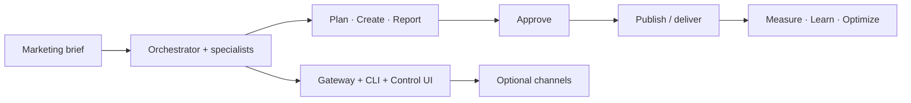

# FoxFang 🦊

<p align="center">
    
    
</p>

<p align="center">
  <strong>Specialized autonomous agent system for digital marketing.</strong><br />
  Assign marketing work in natural language — campaign prep, content calendars, drafts, reporting, and insights for the next cycle.
</p>

<Columns>
  <Card title="Get Started" href="/start/getting-started" icon="rocket">
    Install FoxFang, seed your marketing workspace, and start the Gateway.
  </Card>
  <Card title="Run Onboarding" href="/start/wizard" icon="sparkles">
    Guided setup with `foxfang onboard` — brand context, providers, and optional channels.
  </Card>
  <Card title="Open the Control UI" href="/web/control-ui" icon="layout-dashboard">
    Work from the browser dashboard — briefs, sessions, config, and approvals.
  </Card>
</Columns>

## What is FoxFang?

FoxFang is a **specialized autonomous agent system for digital marketing**. You assign work in natural language — marketing briefs, campaign prep, content calendars, post drafts, trend monitoring, reports, ad analysis, lead follow-up — and the system analyzes brand, product, audience, channels, and work history to choose an approach.

Marketing work follows an operations loop:

```text
Brief → Strategy → Plan → Create → Approve → Publish → Measure → Learn → Optimize
```

FoxFang is **not** a general-purpose chatbot, **not** fixed workflow automation, and **not** “send a message, get a reply” as the product definition. It maintains **brand context, product intelligence, content history, and insights** so later cycles stay connected to earlier decisions.

WhatsApp, Telegram, Discord, iMessage, and other channels are **delivery surfaces** — where you assign work, approve outbound actions, and receive drafts or reports. The product is the marketing operations agent: a coordinator plus specialists (Strategy, Content, Growth) with tools, memory, and **approval-before-write** for sensitive actions.

**Who is it for?** Solo operators, creators, small businesses, and lean teams who want marketing operations support without giving up data control or final judgment on brand and budget.

**What makes it different?**

- **Marketing-first**: briefs, plans, drafts, calendars, reporting, and learnings — not disconnected Q&A
- **Stateful memory**: brand voice, campaigns, approved content, and past insights carry forward
- **Human control**: read-first, draft-first; publish/send/bulk outreach and ad spend changes need explicit approval
- **Self-hosted**: runs on your hardware; optional multi-channel delivery through one Gateway
- **Open source**: MIT licensed, community-driven

**What do you need?** Node 24 (recommended), or Node 22 LTS (`22.14+`) for compatibility, an API key from your chosen provider, and 5 minutes. For best quality and security, use the strongest latest-generation model available.

## How it works



The **agent and workspace** hold brand context, campaigns, and memory. The **Gateway** is the runtime control plane (sessions, tools, optional channel delivery).

## Key capabilities

<Columns>
  <Card title="Marketing operations loop" icon="workflow">
    Brief through optimize — planning, drafts, approval gates, reporting, and insights.
  </Card>
  <Card title="Brand and campaign memory" icon="brain">
    Voice, product context, approved content, and learnings across cycles.
  </Card>
  <Card title="Multi-agent specialists" icon="route">
    Orchestrator delegates to Strategy, Content, and Growth workflows.
  </Card>
  <Card title="Approval before outbound" icon="shield-check">
    Draft-first publishing, bulk messages, and ad changes stay human-controlled.
  </Card>
  <Card title="Web Control UI" icon="monitor">
    Browser dashboard for briefs, sessions, config, and approvals.
  </Card>
  <Card title="Optional channel delivery" icon="network">
    WhatsApp, Telegram, Discord, iMessage, and plugins when you want updates in chat apps.
  </Card>
</Columns>

## Quick start

<Steps>
  <Step title="Install FoxFang">
    ```bash
    npm install -g foxfang@latest
    ```
  </Step>
  <Step title="Onboard and install the service">
    ```bash
    foxfang onboard --install-daemon
    ```
  </Step>
  <Step title="Assign marketing work">
    Open the Control UI and start from a brief or task:

    ```bash
    foxfang dashboard
    ```

    Optionally connect a channel ([Telegram](/channels/telegram) is fastest) for approvals and delivery on the go.

  </Step>
</Steps>

Need the full install and dev setup? See [Getting Started](/start/getting-started).

## Dashboard

Open the browser Control UI after the Gateway starts.

- Local default: [http://127.0.0.1:18789/](http://127.0.0.1:18789/)
- Remote access: [Web surfaces](/web) and [Tailscale](/gateway/tailscale)

<p align="center">
  
</p>

## Configuration (optional)

Config lives at `~/.foxfang/foxfang.json`.

- If you **do nothing**, FoxFang uses the bundled Pi binary in RPC mode with per-sender sessions.
- If you want to lock it down, start with `channels.whatsapp.allowFrom` and (for groups) mention rules.

Example:

```json5
{
  channels: {
    whatsapp: {
      allowFrom: ["+15555550123"],
      groups: { "*": { requireMention: true } },
    },
  },
  messages: { groupChat: { mentionPatterns: ["@foxfang"] } },
}
```

## Start here

<Columns>
  <Card title="Docs hubs" href="/start/hubs" icon="book-open">
    All docs and guides, organized by use case.
  </Card>
  <Card title="Configuration" href="/gateway/configuration" icon="settings">
    Core Gateway settings, tokens, and provider config.
  </Card>
  <Card title="Remote access" href="/gateway/remote" icon="globe">
    SSH and tailnet access patterns.
  </Card>
  <Card title="Channels" href="/channels/telegram" icon="message-square">
    Channel-specific setup for WhatsApp, Telegram, Discord, and more.
  </Card>
  <Card title="Nodes" href="/nodes" icon="smartphone">
    iOS and Android nodes with pairing, Canvas, camera, and device actions.
  </Card>
  <Card title="Help" href="/help" icon="life-buoy">
    Common fixes and troubleshooting entry point.
  </Card>
</Columns>

## Learn more

<Columns>
  <Card title="Full feature list" href="/concepts/features" icon="list">
    Complete channel, routing, and media capabilities.
  </Card>
  <Card title="Multi-agent routing" href="/concepts/multi-agent" icon="route">
    Workspace isolation and per-agent sessions.
  </Card>
  <Card title="Security" href="/gateway/security" icon="shield">
    Tokens, allowlists, and safety controls.
  </Card>
  <Card title="Troubleshooting" href="/gateway/troubleshooting" icon="wrench">
    Gateway diagnostics and common errors.
  </Card>
  <Card title="About and credits" href="/reference/credits" icon="info">
    Project origins, contributors, and license.
  </Card>
</Columns>
