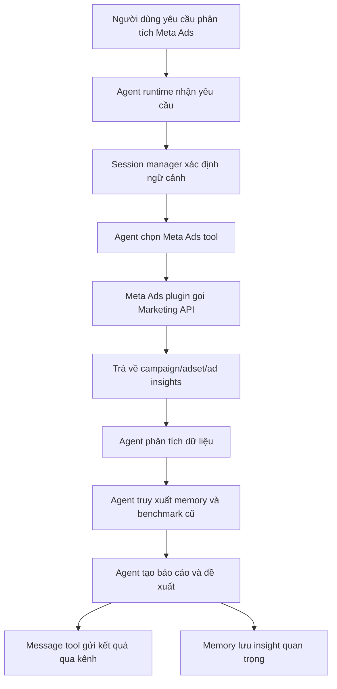
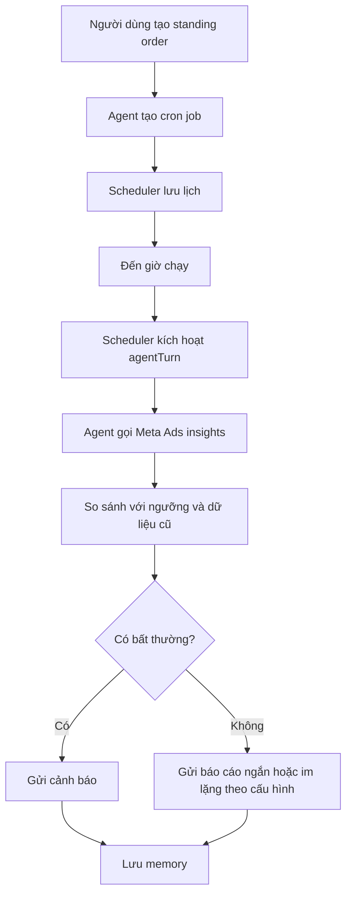

# FEATURE BỔ SUNG: TÍCH HỢP HỖ TRỢ META ADS CHO HỆ THỐNG TÁC NHÂN TỰ CHỦ MARKETING SỐ

## 1. Mục đích bổ sung feature

Trong marketing số, quảng cáo trả phí là một phần quan trọng bên cạnh hoạt động tạo nội dung tự nhiên, quản lý kênh, chăm sóc khách hàng và báo cáo. Đối với nhiều doanh nghiệp nhỏ, Meta Ads gồm Facebook Ads và Instagram Ads là nền tảng quảng cáo phổ biến vì có lượng người dùng lớn, khả năng nhắm mục tiêu chi tiết và hệ thống đo lường hiệu quả chiến dịch.

Hệ thống tác nhân tự chủ trong đồ án hiện tập trung vào tự động hóa quy trình marketing số đa kênh, bao gồm lập kế hoạch, tạo nội dung, sử dụng công cụ, ghi nhớ ngữ cảnh, chạy tác vụ định kỳ và phản hồi qua nhiều kênh. Việc bổ sung feature hỗ trợ Meta Ads giúp phạm vi marketing của hệ thống đầy đủ hơn, vì tác nhân không chỉ hỗ trợ nội dung và lịch vận hành, mà còn có thể hỗ trợ người dùng trong quá trình phân tích, lập kế hoạch, giám sát và tối ưu quảng cáo trả phí.

Feature này được đề xuất như một module mở rộng của hệ thống, không thay thế toàn bộ Meta Ads Manager. Vai trò chính của module là giúp tác nhân kết nối với dữ liệu quảng cáo, phân tích hiệu quả chiến dịch, đề xuất cải thiện và hỗ trợ tạo bản nháp chiến dịch hoặc nội dung quảng cáo dưới sự kiểm soát của người dùng.

## 2. Lý do cần có Meta Ads trong hệ thống

Marketing số thường gồm hai nhóm hoạt động lớn:

- Organic marketing: nội dung tự nhiên, cộng đồng, SEO, mạng xã hội, email, tin nhắn, chăm sóc khách hàng.
- Paid marketing: quảng cáo trả phí trên các nền tảng như Meta Ads, Google Ads, TikTok Ads, LinkedIn Ads.

Nếu hệ thống chỉ hỗ trợ tạo nội dung và gửi tin nhắn, đồ án vẫn đúng với hướng tự động hóa marketing, nhưng chưa phản ánh đầy đủ quy trình marketing thực tế. Meta Ads giúp bổ sung các bài toán quan trọng:

- Lập kế hoạch ngân sách quảng cáo.
- Tạo nhiều biến thể nội dung quảng cáo.
- Theo dõi chỉ số chiến dịch.
- So sánh hiệu quả giữa campaign, ad set và ad.
- Phát hiện quảng cáo có chi phí cao hoặc hiệu quả thấp.
- Đề xuất điều chỉnh đối tượng, nội dung, ngân sách hoặc lịch chạy.
- Tạo báo cáo định kỳ cho người dùng.

Feature này cũng phù hợp với bản chất agentic của hệ thống. Tác nhân có thể nhận mục tiêu cấp cao như “theo dõi chiến dịch này mỗi sáng và báo cáo nếu CPA tăng quá 20%”, sau đó tự gọi công cụ Meta Ads, phân tích dữ liệu, lưu ghi nhớ và gửi báo cáo qua kênh đã cấu hình.

## 3. Phạm vi đề xuất

### 3.1. Trong phạm vi

Feature Meta Ads đề xuất hỗ trợ các nhóm chức năng sau:

- Kết nối tài khoản Meta Business hoặc ad account thông qua token/API.
- Đọc danh sách ad account người dùng được phép truy cập.
- Đọc danh sách campaign, ad set và ad.
- Đọc chỉ số hiệu quả quảng cáo theo khoảng thời gian.
- Phân tích các chỉ số như impressions, reach, clicks, CTR, CPC, spend, conversions, CPA, ROAS nếu có dữ liệu.
- Tạo báo cáo ngắn gọn bằng ngôn ngữ tự nhiên.
- Đề xuất hướng tối ưu dựa trên dữ liệu.
- Tạo bản nháp nội dung quảng cáo và biến thể creative.
- Tạo lịch theo dõi tự động bằng scheduler của hệ thống.
- Gửi báo cáo qua các kênh như CLI, Telegram, Discord hoặc Slack.
- Lưu thông tin chiến dịch, insight quan trọng và quyết định tối ưu vào memory.

### 3.2. Ngoài phạm vi giai đoạn đầu

Để đảm bảo an toàn, feature giai đoạn đầu không nên tự động thay đổi campaign thật nếu chưa có xác nhận của người dùng. Các hành động sau nên để ngoài phạm vi hoặc yêu cầu approval rõ ràng:

- Tự động tăng/giảm ngân sách thật.
- Tự động bật/tắt campaign thật.
- Tự động publish ad creative thật.
- Tự động thay đổi targeting thật.
- Tự động tạo campaign tiêu tiền nếu chưa có xác nhận.

Trong đồ án, phạm vi hợp lý nhất là **read-first, draft-first, approval-before-write**. Nghĩa là hệ thống được phép đọc dữ liệu, phân tích, đề xuất, tạo bản nháp; mọi hành động ghi lên Meta Ads cần người dùng duyệt.

## 4. Mối liên hệ với kiến trúc hiện tại

Feature Meta Ads phù hợp với kiến trúc hiện tại vì hệ thống đã có sẵn các thành phần sau:

| Thành phần hiện có | Cách Meta Ads sử dụng                                           |
| ------------------ | --------------------------------------------------------------- |
| Agent runtime      | Tác nhân phân tích yêu cầu, gọi tool Meta Ads, tổng hợp báo cáo |
| Tool registry      | Meta Ads được thêm như nhóm tool mới                            |
| Plugin system      | Có thể triển khai Meta Ads dưới dạng plugin/extension riêng     |
| Cron scheduler     | Tạo báo cáo quảng cáo định kỳ                                   |
| Memory             | Lưu insight, benchmark, quyết định tối ưu và mục tiêu campaign  |
| Session manager    | Tách ngữ cảnh theo người dùng, channel hoặc campaign            |
| Message tool       | Gửi báo cáo và cảnh báo qua Telegram, Discord, Slack            |
| Web search/fetch   | Bổ sung nghiên cứu đối thủ hoặc xu hướng creative               |
| Security policy    | Kiểm soát quyền đọc/ghi, approval và secret                     |

Do đó, không cần thay đổi kiến trúc lõi. Meta Ads nên được thiết kế như một **plugin tool group** hoặc **extension** mới, ví dụ:

```text
extensions/meta-ads/
```

Plugin này đăng ký các tool vào tool registry để agent có thể gọi khi cần.

## 5. Thiết kế chức năng

### 5.1. Nhóm chức năng kết nối tài khoản

Hệ thống cần hỗ trợ cấu hình thông tin xác thực cho Meta Marketing API. Người dùng có thể cấu hình qua CLI hoặc file cấu hình.

Thông tin cần có:

- Meta App ID.
- Meta App Secret.
- Access token hoặc OAuth flow.
- Business ID nếu có.
- Ad Account ID.
- Quyền truy cập cần thiết, ví dụ `ads_read`, `ads_management` nếu có thao tác ghi.

Ở giai đoạn đầu, nên chỉ yêu cầu quyền đọc:

```text
ads_read
read_insights
```

Nếu sau này hỗ trợ tạo hoặc chỉnh sửa campaign, mới yêu cầu quyền ghi:

```text
ads_management
```

### 5.2. Nhóm chức năng đọc dữ liệu quảng cáo

Các tool đọc dữ liệu có thể gồm:

| Tool                      | Mục đích                                          |
| ------------------------- | ------------------------------------------------- |
| `meta_ads_accounts_list`  | Liệt kê ad accounts có quyền truy cập             |
| `meta_ads_campaigns_list` | Liệt kê campaign theo account                     |
| `meta_ads_adsets_list`    | Liệt kê ad set trong campaign                     |
| `meta_ads_ads_list`       | Liệt kê quảng cáo trong ad set/campaign           |
| `meta_ads_insights_get`   | Lấy số liệu campaign/adset/ad theo thời gian      |
| `meta_ads_creatives_get`  | Lấy nội dung creative, copy, image/video metadata |

Ví dụ người dùng hỏi:

```text
Hãy xem chiến dịch Facebook Ads tuần này có vấn đề gì không.
```

Tác nhân có thể:

1. Xác định ad account mặc định từ cấu hình.
2. Gọi `meta_ads_campaigns_list`.
3. Gọi `meta_ads_insights_get` cho các campaign đang active.
4. So sánh các chỉ số spend, CTR, CPC, CPA.
5. Tạo báo cáo bằng ngôn ngữ tự nhiên.

### 5.3. Nhóm chức năng phân tích hiệu quả

Tác nhân cần phân tích dữ liệu theo các chỉ số cơ bản:

| Chỉ số      | Ý nghĩa                          |
| ----------- | -------------------------------- |
| Spend       | Tổng chi phí đã tiêu             |
| Impressions | Số lượt hiển thị                 |
| Reach       | Số người tiếp cận                |
| Clicks      | Số lượt nhấp                     |
| CTR         | Tỷ lệ nhấp                       |
| CPC         | Chi phí mỗi lượt nhấp            |
| CPM         | Chi phí mỗi 1000 lượt hiển thị   |
| Conversions | Số chuyển đổi                    |
| CPA         | Chi phí mỗi chuyển đổi           |
| ROAS        | Doanh thu trên chi phí quảng cáo |

Tác nhân có thể đưa ra nhận định như:

- Campaign nào đang tiêu nhiều nhưng CTR thấp.
- Ad set nào có CPC tăng bất thường.
- Creative nào có engagement tốt hơn.
- Ngân sách có đang dồn vào nhóm kém hiệu quả không.
- Có nên test thêm thông điệp hoặc hình ảnh mới không.

### 5.4. Nhóm chức năng tạo bản nháp quảng cáo

Hệ thống có thể hỗ trợ tạo bản nháp nội dung quảng cáo dựa trên thông tin thương hiệu và mục tiêu campaign. Các đầu ra gồm:

- Primary text.
- Headline.
- Description.
- Call to action.
- Gợi ý hình ảnh/video.
- Biến thể A/B testing.
- Gợi ý audience.
- Gợi ý campaign objective.

Ví dụ:

```text
Hãy tạo 5 biến thể quảng cáo Meta Ads cho sản phẩm thảm yoga cao cấp, hướng đến phụ nữ 25-40 tuổi.
```

Tác nhân có thể dùng thông tin từ `USER.md`, `MEMORY.md`, brand context và dữ liệu campaign cũ để tạo nội dung phù hợp hơn.

### 5.5. Nhóm chức năng giám sát định kỳ

Feature Meta Ads nên tận dụng scheduler hiện có. Người dùng có thể yêu cầu:

```text
Mỗi ngày lúc 8 giờ sáng hãy kiểm tra các chiến dịch Meta Ads đang chạy và báo cáo nếu có campaign nào CPA tăng hơn 20%.
```

Luồng xử lý:

1. Agent gọi `cron` để tạo job định kỳ.
2. Đến giờ, scheduler chạy một `agentTurn`.
3. Agent gọi tool Meta Ads để lấy insight mới nhất.
4. Agent so sánh với dữ liệu trước đó trong memory.
5. Agent gửi báo cáo qua kênh đã cấu hình.
6. Agent lưu lại insight hoặc cảnh báo vào memory.

### 5.6. Nhóm chức năng cảnh báo

Hệ thống có thể cảnh báo khi:

- Spend vượt ngưỡng ngày.
- Campaign active nhưng không có conversion.
- CTR giảm dưới ngưỡng.
- CPC hoặc CPA tăng bất thường.
- Campaign hết ngân sách.
- Ad bị reject hoặc limited delivery.
- Tần suất hiển thị quá cao.
- Creative mỏi, hiệu quả giảm theo thời gian.

Các cảnh báo nên được gửi qua message tool đến kênh người dùng đã chọn.

## 6. Thiết kế tool schema đề xuất

### 6.1. Tool `meta_ads_insights_get`

Mục đích: lấy số liệu quảng cáo từ Meta Ads.

Input đề xuất:

```json
{
  "adAccountId": "act_123456789",
  "level": "campaign",
  "entityIds": ["123", "456"],
  "datePreset": "last_7d",
  "since": "2026-05-01",
  "until": "2026-05-07",
  "fields": ["spend", "impressions", "clicks", "ctr", "cpc", "conversions"]
}
```

Output đề xuất:

```json
{
  "status": "ok",
  "level": "campaign",
  "rows": [
    {
      "id": "123",
      "name": "Campaign A",
      "spend": 120.5,
      "impressions": 50000,
      "clicks": 820,
      "ctr": 1.64,
      "cpc": 0.147,
      "conversions": 32
    }
  ]
}
```

### 6.2. Tool `meta_ads_campaign_draft_create`

Mục đích: tạo bản nháp cấu trúc campaign, chưa publish.

Input đề xuất:

```json
{
  "objective": "LEADS",
  "budgetDaily": 20,
  "audience": {
    "locations": ["Vietnam"],
    "ageMin": 25,
    "ageMax": 40,
    "interests": ["yoga", "fitness", "wellness"]
  },
  "creativeVariants": [
    {
      "primaryText": "Tập yoga thoải mái hơn với thảm cao cấp...",
      "headline": "Thảm yoga êm và bám sàn",
      "callToAction": "SHOP_NOW"
    }
  ]
}
```

Output đề xuất:

```json
{
  "status": "draft",
  "draftId": "local-draft-001",
  "requiresApproval": true,
  "summary": "Đã tạo bản nháp campaign LEADS với ngân sách 20 USD/ngày."
}
```

### 6.3. Tool `meta_ads_recommendations_generate`

Mục đích: tạo đề xuất tối ưu từ dữ liệu insight.

Input đề xuất:

```json
{
  "adAccountId": "act_123456789",
  "campaignId": "123",
  "datePreset": "last_14d",
  "goal": "reduce_cpa"
}
```

Output đề xuất:

```json
{
  "status": "ok",
  "recommendations": [
    {
      "priority": "high",
      "type": "creative_test",
      "reason": "CTR giảm 35% trong 7 ngày gần nhất.",
      "suggestion": "Tạo 3 biến thể creative mới tập trung vào lợi ích giảm đau cổ tay khi tập yoga."
    }
  ]
}
```

## 7. Luồng xử lý đề xuất



## 8. Luồng giám sát định kỳ



## 9. Yêu cầu bảo mật và kiểm soát

Meta Ads là feature nhạy cảm vì có thể liên quan đến ngân sách thật. Do đó cần áp dụng các nguyên tắc:

- Mặc định chỉ đọc dữ liệu quảng cáo.
- Mọi thao tác tạo/sửa/xóa/publish campaign phải cần approval.
- Tách quyền `ads_read` và `ads_management`.
- Không lưu access token trực tiếp trong Markdown hoặc log.
- Redact token trong lỗi và diagnostic.
- Gắn ad account với owner hoặc workspace cụ thể.
- Ghi log mọi thao tác ghi.
- Cho phép dry-run trước khi publish.
- Cho phép cấu hình ngân sách tối đa mà agent không được vượt qua.
- Cảnh báo khi prompt yêu cầu hành động có thể tiêu tiền.

Các hành động cần approval:

| Hành động                 | Cần approval                     |
| ------------------------- | -------------------------------- |
| Đọc insights              | Không, nếu đã cấu hình quyền đọc |
| Tạo báo cáo               | Không                            |
| Tạo draft creative        | Không                            |
| Tạo draft campaign local  | Không                            |
| Publish campaign lên Meta | Có                               |
| Tăng ngân sách            | Có                               |
| Tắt/bật campaign          | Có                               |
| Sửa targeting             | Có                               |
| Xóa campaign/ad/adset     | Có                               |

## 10. Yêu cầu dữ liệu và cấu hình

Cấu hình đề xuất:

```json
{
  "plugins": {
    "meta-ads": {
      "enabled": true,
      "defaultAdAccountId": "act_123456789",
      "auth": {
        "accessToken": {
          "provider": "default",
          "source": "env",
          "id": "META_ADS_ACCESS_TOKEN"
        }
      },
      "safety": {
        "readOnly": true,
        "requireApprovalForWrite": true,
        "maxDailyBudgetWithoutApproval": 0
      }
    }
  }
}
```

Dữ liệu nên lưu trong memory:

- Tên campaign quan trọng.
- Mục tiêu campaign.
- Ngân sách mục tiêu.
- Benchmark CTR/CPC/CPA.
- Các creative đã test.
- Nhận định từ các báo cáo trước.
- Quyết định tối ưu đã được người dùng duyệt.

## 11. Kịch bản sử dụng trong đồ án

### 11.1. Kịch bản phân tích chiến dịch

Người dùng:

```text
Hãy phân tích hiệu quả các chiến dịch Meta Ads trong 7 ngày gần nhất và cho tôi biết campaign nào cần tối ưu.
```

Hệ thống:

1. Agent gọi `meta_ads_campaigns_list`.
2. Agent gọi `meta_ads_insights_get`.
3. Agent tính các chỉ số CTR, CPC, CPA.
4. Agent so sánh với benchmark trong memory.
5. Agent tạo báo cáo gồm vấn đề, nguyên nhân khả dĩ và đề xuất.
6. Agent gửi kết quả qua kênh gốc.

### 11.2. Kịch bản tạo creative quảng cáo

Người dùng:

```text
Tạo 5 biến thể quảng cáo Facebook cho sản phẩm thảm yoga cao cấp, giọng văn nhẹ nhàng và tập trung vào lợi ích sức khỏe.
```

Hệ thống:

1. Agent đọc thông tin thương hiệu trong workspace.
2. Agent truy xuất memory về phong cách viết.
3. Agent tạo 5 biến thể primary text, headline và CTA.
4. Agent đề xuất hình ảnh/video phù hợp.
5. Agent có thể lưu các biến thể vào draft local.

### 11.3. Kịch bản giám sát tự động

Người dùng:

```text
Mỗi sáng hãy kiểm tra Meta Ads và báo tôi nếu có campaign tiêu hơn 500.000 VND nhưng không có chuyển đổi.
```

Hệ thống:

1. Agent tạo cron job.
2. Scheduler chạy mỗi sáng.
3. Agent gọi insights.
4. Agent lọc campaign theo điều kiện spend và conversions.
5. Agent gửi cảnh báo nếu có vấn đề.
6. Agent lưu kết quả vào memory.

## 12. Kiểm thử đề xuất

| Mã         | Kịch bản                  | Kết quả mong đợi                              |
| ---------- | ------------------------- | --------------------------------------------- |
| META-TC-01 | Không có token            | Tool báo lỗi cấu hình rõ ràng                 |
| META-TC-02 | Token chỉ có quyền đọc    | Đọc insights thành công, thao tác ghi bị chặn |
| META-TC-03 | Liệt kê campaign          | Trả danh sách campaign đúng ad account        |
| META-TC-04 | Lấy insights 7 ngày       | Trả dữ liệu theo date range                   |
| META-TC-05 | Campaign không có dữ liệu | Báo không có dữ liệu thay vì lỗi              |
| META-TC-06 | Tạo draft creative        | Trả draft local, không publish                |
| META-TC-07 | Yêu cầu tăng ngân sách    | Hệ thống yêu cầu approval                     |
| META-TC-08 | Cron monitoring           | Scheduler chạy và gửi báo cáo đúng kênh       |
| META-TC-09 | Lỗi API Meta              | Tool retry hoặc trả lỗi có hướng xử lý        |
| META-TC-10 | Memory benchmark          | Agent so sánh chỉ số mới với dữ liệu cũ       |

## 13. Cách bổ sung vào đồ án chính

Feature này có thể được đưa vào đồ án chính ở các phần sau:

- Chương 1: mở rộng phạm vi ứng dụng marketing số, bổ sung quảng cáo trả phí.
- Chương 2: thêm mục về paid ads, Meta Ads và chỉ số đo lường quảng cáo.
- Chương 3: thêm Meta Ads plugin vào thiết kế tool registry.
- Chương 4: thêm kịch bản demo phân tích campaign và báo cáo định kỳ.
- Chương 5: nêu Meta Ads là hướng phát triển hoặc module mở rộng có thể triển khai tiếp.

Đoạn có thể thêm vào Chương 4:

> Ngoài các chức năng tạo nội dung, nhắc lịch và giao tiếp đa kênh, hệ thống có thể mở rộng để hỗ trợ quảng cáo trả phí thông qua plugin Meta Ads. Plugin này cung cấp các công cụ đọc campaign, ad set, ad và insight từ Meta Marketing API. Tác nhân sử dụng dữ liệu này để tạo báo cáo hiệu quả, phát hiện bất thường, đề xuất tối ưu và tạo bản nháp nội dung quảng cáo. Các thao tác có thể ảnh hưởng đến ngân sách thật như tăng ngân sách, bật/tắt campaign hoặc publish creative cần được người dùng duyệt trước khi thực thi.

## 14. Kết luận

Feature Meta Ads giúp đồ án phản ánh đầy đủ hơn bài toán marketing số thực tế. Khi kết hợp với kiến trúc tác nhân tự chủ, bộ nhớ dài hạn, scheduler và đa kênh, hệ thống có thể hỗ trợ người dùng không chỉ trong việc tạo nội dung mà còn trong việc giám sát và cải thiện hiệu quả quảng cáo trả phí.

Trong phạm vi đồ án, feature này nên được trình bày như một module mở rộng hợp lý, ưu tiên đọc dữ liệu, phân tích và đề xuất. Các thao tác ghi lên Meta Ads cần có approval để đảm bảo an toàn, tránh rủi ro tiêu ngân sách hoặc thay đổi campaign ngoài ý muốn.
