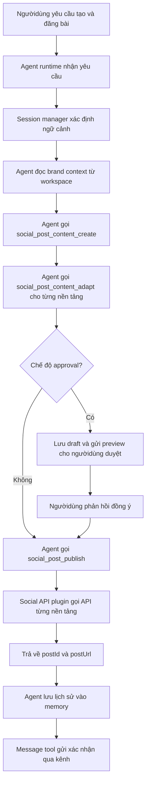
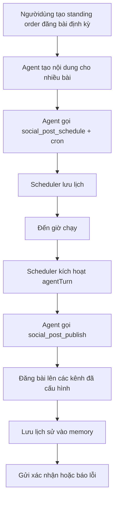

# FEATURE BỔ SUNG: ĐĂNG BÀI ĐA NỀN TẢNG MẠNG XÃ HỘI (CROSS-PLATFORM SOCIAL POSTING)

## 1. Mục đích bổ sung feature

Trong marketing số hiện đại, sự hiện diện đa kênh trên mạng xã hội là yêu cầu cơ bản để tiếp cận đối tượng khách hàng đa dạng. Một chiến dịch marketing thường cần phân phối nội dung đồng thờilên nhiều nền tảng như Facebook Fanpage, Instagram, TikTok, LinkedIn, v.v. Tuy nhiên, việc tạo nội dung riêng lẻ cho từng kênh, điều chỉnh định dạng, sao chép-dán và đăng bài thủ công trên từng nền tảng tiêu tốn nhiều thờigian và dễ thiếu nhất quán về thông điệp.

Hệ thống tác nhân tự chủ trong đồ án hiện hỗ trợ tạo nội dung marketing, lập kế hoạch, nhắc việc, báo cáo và giao tiếp qua nhiều kênh nhắn tin. Tuy nhiên, tác nhân chưa có khả năng **trực tiếp xuất bản nội dung lên các nền tảng mạng xã hội** thông qua API của từng nền tảng. Ngườidùng vẫn phải tự sao chép nội dung từ tác nhân và đăng thủ công lên từng kênh social.

Feature này đề xuất bổ sung khả năng **cross-platform social posting**, cho phép tác nhân:

- Tạo một bài đăng chuẩn hóa từ yêu cầu của ngườidùng.
- Tùy chỉnh nội dung theo định dạng và giới hạn ký tự của từng nền tảng.
- Đăng bài đồng thờihoặc lên lịch đăng lên nhiều kênh social mà ngườidùng đã cấu hình.
- Lưu trữ lịch sử đăng bài và hiệu quả cơ bản vào memory.

## 2. Lý do cần có Cross-Platform Posting trong hệ thống

Marketing số đa kênh đòi hỏi sự nhất quán trong thông điệp nhưng linh hoạt trong định dạng. Nếu tác nhân chỉ dừng lại ở việc "tạo nội dung và gửi cho ngườidùng", quy trình marketing vẫn bị gián đoạn ở bước xuất bản.

Việc bổ sung feature cross-platform posting giải quyết các bài toán:

- **Giảm công việc lặp lại:** Ngườidùng không cần đăng thủ công lên từng kênh.
- **Tăng tính nhất quán:** Cùng một thông điệp được điều chỉnh phù hợp nhưng vẫn giữ cốt lõi trên mọi kênh.
- **Tối ưu định dạng:** Tự động điều chỉnh caption, hashtag, kích thước hình ảnh, đề cập (@mention) theo chuẩn từng nền tảng.
- **Lập lịch xuất bản:** Tác nhân có thể đăng bài vào thờigian tối ưu hoặc theo lịch chiến dịch.
- **Theo dõi sau đăng:** Lưu lại danh sách bài đã đăng để hỗ trợ báo cáo và phân tích sau này.
- **Phối hợp với scheduler:** Kết hợp với cron để tạo chiến dịch đăng bài tự động theo tuần/tháng.

## 3. Phạm vi đề xuất

### 3.1. Trong phạm vi

Feature cross-platform posting đề xuất hỗ trợ các nhóm chức năng sau:

- Kết nối tài khoản social qua API token (Facebook/Instagram via Meta Graph API, TikTok, LinkedIn, X/Twitter).
- Tạo nội dung bài đăng từ yêu cầu ngôn ngữ tự nhiên của ngườidùng.
- Tùy chỉnh bản sao nội dung theo từng nền tảng (ví dụ: Instagram cần hashtag nhiều hơn, LinkedIn cần giọng văn chuyên nghiệp hơn, TikTok cần caption ngắn và trending sound gợi ý).
- Đăng bài ngay lập tức lên một hoặc nhiều kênh đã chọn.
- Lên lịch đăng bài (schedule) tích hợp với cron của hệ thống.
- Hỗ trợ đính kèm hình ảnh, video hoặc link.
- Lưu lịch sử đăng bài vào memory/workspace để tra cứu sau này.
- Gửi xác nhận hoặc báo cáo lỗi qua kênh giao tiếp (CLI, Telegram, Discord, Slack).
- Hỗ trợ chế độ **nháp (draft)** để ngườidùng duyệt trước khi đăng.

### 3.2. Ngoài phạm vi giai đoạn đầu

Để đảm bảo an toàn và tuân thủ chính sách của các nền tảng, các hành động sau nên để ngoài phạm vi hoặc yêu cầu approval rõ ràng:

- Tự động đăng bài mà không có xác nhận ngườidùng (nếu chưa bật auto-publish).
- Tự động trả lời comment hoặc tin nhắn trên các bài đăng.
- Tự động chạy quảng cáo trả phí (boost post) trên bài đã đăng.
- Chỉnh sửa hoặc xóa bài đã đăng trước đó nếu chưa được phép.
- Tự động thêm tài khoản quảng cáo hoặc thanh toán.

Phạm vi hợp lý nhất là **draft-first, approval-before-publish**. Tác nhân được phép tạo nội dung, đề xuất kênh, lập lịch; mọi hành động publish lên social cần ngườidùng xác nhận hoặc đã bật chế độ tin cậy cho kênh đó.

## 4. Mối liên hệ với kiến trúc hiện tại

Feature cross-platform posting phù hợp với kiến trúc hiện tại vì hệ thống đã có sẵn các thành phần sau:

| Thành phần hiện có | Cách Cross-Platform Posting sử dụng                                                  |
| ------------------ | ------------------------------------------------------------------------------------ |
| Agent runtime      | Tác nhân phân tích yêu cầu, gọi tool tạo nội dung và publish                         |
| Tool registry      | Thêm nhóm tool social-post để tạo nội dung và đăng bài                               |
| Plugin system      | Triển khai mỗi nền tảng như một plugin riêng (meta-post, tiktok-post, linkedin-post) |
| Cron scheduler     | Lập lịch đăng bài định kỳ hoặc theo chiến dịch                                       |
| Memory             | Lưu lịch sử đăng bài, hiệu quả, nội dung đã đăng để tránh trùng lặp                  |
| Session manager    | Tách ngữ cảnh theo chiến dịch, kênh hoặc ngườidùng                                   |
| Message tool       | Gửi xác nhận, nhắc duyệt hoặc báo cáo lỗi qua Telegram, Discord, Slack               |
| Workspace files    | Đọc phong cách thương hiệu từ `SOUL.md`, `IDENTITY.md`, `USER.md`                    |
| Security policy    | Kiểm soát quyền publish, approval và secret token                                    |

Do đó, không cần thay đổi kiến trúc lõi. Cross-platform posting nên được thiết kế như một **nhóm plugin tool** hoặc **extension** mới, ví dụ:

```text
extensions/social-post/
├── meta-post/
├── tiktok-post/
├── linkedin-post/
└── x-post/
```

## 5. Thiết kế chức năng

### 5.1. Nhóm chức năng kết nối tài khoản

Hệ thống cần hỗ trợ cấu hình thông tin xác thực cho từng nền tảng social. Ngườidùng có thể cấu hình qua CLI hoặc file cấu hình.

Thông tin cần có theo nền tảng:

**Meta (Facebook Fanpage + Instagram):**

- Meta App ID, App Secret.
- Page Access Token (cho Facebook Fanpage).
- Instagram Business Account ID (nếu đăng Instagram).
- Quyền: `pages_read_engagement`, `pages_manage_posts`, `instagram_content_publish`.

**TikTok:**

- TikTok App ID, App Secret.
- Access Token hoặc OAuth flow.
- Creator/Business Account ID.

**LinkedIn:**

- LinkedIn Client ID, Client Secret.
- Access Token với quyền `w_member_social` (personal) hoặc `w_organization_social` (company page).
- Organization ID (nếu đăng lên company page).

**X/Twitter:**

- API Key, API Secret Key.
- Access Token, Access Token Secret.
- Hoặc OAuth 2.0 Bearer Token nếu dùng API v2.

### 5.2. Nhóm chức năng tạo nội dung đa nền tảng

Tác nhân nhận yêu cầu từ ngườidùng, sau đó tạo các biến thể nội dung phù hợp với từng nền tảng.

Ví dụ ngườidùng yêu cầu:

```text
Hãy tạo bài đăng giới thiệu sản phẩm thảm yoga cao cấp và đăng lên Facebook, Instagram và LinkedIn.
```

Tác nhân có thể tạo:

| Nền tảng         | Nội dung điều chỉnh                                                     |
| ---------------- | ----------------------------------------------------------------------- |
| Facebook Fanpage | Caption dài hơn, có thể kèm link sản phẩm, CTA rõ ràng                  |
| Instagram        | Caption ngắn gọn, 10-15 hashtag liên quan, gợi ý hình ảnh vuông 1:1     |
| LinkedIn         | Giọng văn chuyên nghiệp, tập trung lợi ích doanh nghiệp/cộng đồng       |
| TikTok           | Caption ngắn (< 100 ký tự), trending hashtag, gợi ý âm thanh/video ngắn |

Các công cụ tạo nội dung:

| Tool                          | Mục đích                                         |
| ----------------------------- | ------------------------------------------------ |
| `social_post_content_create`  | Tạo nội dung gốc từ yêu cầu ngườidùng            |
| `social_post_content_adapt`   | Điều chỉnh nội dung theo định dạng từng nền tảng |
| `social_post_hashtag_suggest` | Gợi ý hashtag phù hợp theo nền tảng và chủ đề    |
| `social_post_media_attach`    | Chuẩn bị metadata hình ảnh/video đính kèm        |

### 5.3. Nhóm chức năng xuất bản (Publish)

Các tool đăng bài:

| Tool                       | Mục đích                                      |
| -------------------------- | --------------------------------------------- |
| `social_post_publish`      | Đăng bài lên một hoặc nhiều kênh đã chọn      |
| `social_post_schedule`     | Lên lịch đăng bài tích hợp với cron           |
| `social_post_draft_save`   | Lưu bài nháp vào local/workspace để duyệt sau |
| `social_post_history_list` | Liệt kê lịch sử bài đã đăng hoặc đã lên lịch  |

### 5.4. Nhóm chức năng lập lịch và tự động hóa

Ngườidùng có thể yêu cầu:

```text
Hãy lập kế hoạch đăng 3 bài mỗi tuần vào thứ 2, 4, 6 lúc 8h sáng, luân phiên giữa Facebook và Instagram.
```

Luồng xử lý:

1. Agent phân tích yêu cầu và tạo nội dung cho từng bài.
2. Agent gọi `cron` để tạo job định kỳ.
3. Scheduler lưu lịch và kích hoạt đúng thờigian.
4. Agent gọi `social_post_publish` khi đến hạn.
5. Agent gửi xác nhận hoặc báo cáo lỗi qua kênh đã cấu hình.
6. Agent lưu lịch sử vào memory.

### 5.5. Nhóm chức năng approval và kiểm soát

Hệ thống cần hỗ trợ các chế độ:

- **Draft mode (mặc định):** Tác nhân tạo nội dung, lưu nháp, gửi thông báo duyệt cho ngườidùng. Chỉ đăng sau khi được phê duyệt.
- **Auto-publish mode (cho kênh tin cậy):** Ngườidùng có thể bật chế độ tự động đăng cho một số kênh nhất định.
- **Require-approval mode:** Mọi bài đăng đều cần xác nhận thủ công.

## 6. Thiết kế tool schema đề xuất

### 6.1. Tool `social_post_content_create`

Mục đích: Tạo nội dung bài đăng từ yêu cầu ngườidùng.

Input đề xuất:

```json
{
  "topic": "Giới thiệu sản phẩm thảm yoga cao cấp",
  "brandVoice": "nhẹ nhàng, thân thiện, chuyên nghiệp",
  "targetPlatforms": ["facebook", "instagram", "linkedin"],
  "mediaType": "image",
  "cta": "Mua ngay với giá ưu đãi",
  "language": "vi"
}
```

Output đề xuất:

```json
{
  "status": "ok",
  "variants": [
    {
      "platform": "facebook",
      "caption": "Khám phá sự khác biệt với thảm yoga cao cấp...",
      "hashtags": ["#YogaVietNam", "#ThảmYoga", "#SứcKhỏe"],
      "cta": "Mua ngay với giá ưu đãi",
      "mediaNote": "Hình ảnh sản phẩm chất lượng cao, tỷ lệ 16:9"
    },
    {
      "platform": "instagram",
      "caption": "Thảm yoga êm ái, bám sàn tuyệt đối...",
      "hashtags": [
        "#YogaDaily",
        "#ThảmYoga",
        "#WellnessJourney",
        "#YogaVietNam",
        "#HealthyLifestyle"
      ],
      "cta": "Link in bio",
      "mediaNote": "Hình vuông 1:1 hoặc 4:5"
    },
    {
      "platform": "linkedin",
      "caption": "Trong bối cảnh sức khỏe tinh thần ngày càng được quan tâm...",
      "hashtags": ["#Wellness", "#Yoga", "#HealthTech"],
      "cta": "Tìm hiểu thêm",
      "mediaNote": "Hình chuyên nghiệp, tỷ lệ 16:9"
    }
  ]
}
```

### 6.2. Tool `social_post_publish`

Mục đích: Đăng bài lên một hoặc nhiều nền tảng.

Input đề xuất:

```json
{
  "draftId": "draft-001",
  "targets": [
    {
      "platform": "facebook",
      "accountId": "page_123456",
      "variantIndex": 0,
      "mediaUrls": ["/workspace/media/yoga_mat_1.jpg"]
    },
    {
      "platform": "instagram",
      "accountId": "ig_business_789",
      "variantIndex": 1,
      "mediaUrls": ["/workspace/media/yoga_mat_1.jpg"]
    }
  ],
  "scheduleAt": null,
  "requireApproval": true
}
```

Output đề xuất:

```json
{
  "status": "pending_approval",
  "approvalId": "apv-001",
  "message": "Bài đăng đang chờ duyệt. Hãy phản hồi 'đồng ý' hoặc click link để publish.",
  "preview": {
    "facebook": "Khám phá sự khác biệt với thảm yoga cao cấp...",
    "instagram": "Thảm yoga êm ái, bám sàn tuyệt đối..."
  }
}
```

Nếu `requireApproval: false`:

```json
{
  "status": "published",
  "results": [
    {
      "platform": "facebook",
      "postId": "fb_post_123",
      "postUrl": "https://facebook.com/...",
      "publishedAt": "2026-05-13T08:00:00Z"
    },
    {
      "platform": "instagram",
      "postId": "ig_post_456",
      "postUrl": "https://instagram.com/p/...",
      "publishedAt": "2026-05-13T08:00:02Z"
    }
  ]
}
```

### 6.3. Tool `social_post_schedule`

Mục đích: Lên lịch đăng bài tích hợp với cron.

Input đề xuất:

```json
{
  "draftId": "draft-002",
  "schedule": {
    "type": "cron",
    "expression": "0 8 * * 1,4,6",
    "timezone": "Asia/Ho_Chi_Minh"
  },
  "targets": [
    { "platform": "facebook", "accountId": "page_123456" },
    { "platform": "instagram", "accountId": "ig_business_789" }
  ]
}
```

Output đề xuất:

```json
{
  "status": "scheduled",
  "jobId": "cron-job-003",
  "nextRun": "2026-05-18T01:00:00Z",
  "summary": "Đã lên lịch đăng bài vào 8h sáng các thứ 2, 4, 6."
}
```

## 7. Luồng xử lý đề xuất



## 8. Luồng lập lịch định kỳ



## 9. Yêu cầu bảo mật và kiểm soát

Cross-platform posting là feature nhạy cảm vì tác nhân có thể xuất bản nội dung lên không gian công khai. Cần áp dụng các nguyên tắc:

- **Mặc định draft-first:** Mọi bài đăng mặc định ở chế độ nháp, cần approval trước khi publish.
- **Tách quyền theo kênh:** Ngườidùng có thể bật auto-publish riêng cho từng kênh.
- **Bảo mật token:** Không lưu access token trực tiếp trong Markdown, log hoặc session transcript. Dùng secret reference.
- **Redact token:** Che giấu token trong lỗi và diagnostic.
- **Kiểm duyệt nội dung:** Tác nhân cần kiểm tra nội dung vi phạm chính sách cộng đồng trước khi đăng.
- **Giới hạn tần suất:** Tránh spam bằng cách giới hạn số bài đăng mỗi giờ/ngày.
- **Ghi log:** Ghi lại mọi thao tác publish, schedule và approval.

Các hành động cần approval:

| Hành động                            | Cần approval                              |
| ------------------------------------ | ----------------------------------------- |
| Tạo nội dung nháp                    | Không                                     |
| Lên lịch đăng bài                    | Không (nhưng cần duyệt trước khi publish) |
| Publish lên kênh mới                 | Có                                        |
| Publish bài đầu tiên lên kênh        | Có (theo mặc định)                        |
| Publish lên kênh đã bật auto-publish | Không                                     |
| Chỉnh sửa/xóa bài đã đăng            | Có                                        |
| Đăng bài có đính kèm media           | Có (nếu chưa được phê duyệt trước)        |

## 10. Yêu cầu dữ liệu và cấu hình

Cấu hình đề xuất:

```json
{
  "plugins": {
    "social-post": {
      "enabled": true,
      "channels": {
        "facebook": {
          "enabled": true,
          "autoPublish": false,
          "defaultPageId": "page_123456",
          "auth": {
            "accessToken": {
              "provider": "default",
              "source": "env",
              "id": "META_PAGE_ACCESS_TOKEN"
            }
          }
        },
        "instagram": {
          "enabled": true,
          "autoPublish": false,
          "businessAccountId": "ig_business_789",
          "auth": {
            "accessToken": {
              "source": "env",
              "id": "META_IG_ACCESS_TOKEN"
            }
          }
        },
        "linkedin": {
          "enabled": false,
          "autoPublish": false,
          "organizationId": "urn:li:organization:12345",
          "auth": {
            "accessToken": {
              "source": "env",
              "id": "LINKEDIN_ACCESS_TOKEN"
            }
          }
        },
        "tiktok": {
          "enabled": false,
          "autoPublish": false,
          "accountId": "tiktok_001",
          "auth": {
            "accessToken": {
              "source": "env",
              "id": "TIKTOK_ACCESS_TOKEN"
            }
          }
        }
      },
      "safety": {
        "defaultRequireApproval": true,
        "maxPostsPerDay": 10,
        "contentPolicyCheck": true
      }
    }
  }
}
```

Dữ liệu nên lưu trong memory/workspace:

- Lịch sử bài đã đăng (platform, postId, postUrl, content, publishedAt).
- Nội dung đã được ngườidùng duyệt (approved drafts).
- Hiệu quả cơ bản nếu API cho phép đọc (likes, comments, shares, reach).
- Phong cách và định dạng ưu tiên cho từng nền tảng.
- Lịch đăng bài định kỳ đang hoạt động.

## 11. Kịch bản sử dụng trong đồ án

### 11.1. Kịch bản tạo và đăng bài đa nền tảng

Ngườidùng:

```text
Hãy tạo bài giới thiệu sản phẩm thảm yoga cao cấp và đăng lên Facebook và Instagram.
```

Hệ thống:

1. Agent đọc phong cách thương hiệu từ `SOUL.md` và `IDENTITY.md`.
2. Agent gọi `social_post_content_create` với topic và target platforms.
3. Agent gọi `social_post_content_adapt` để tạo biến thể Facebook và Instagram.
4. Vì chế độ mặc định là draft-first, agent lưu draft và gửi preview cho ngườidùng.
5. Ngườidùng phản hồi "đồng ý".
6. Agent gọi `social_post_publish` lên Facebook Page và Instagram Business Account.
7. Agent nhận postId, postUrl từ API.
8. Agent lưu lịch sử vào memory và gửi xác nhận kèm link bài đăng.

### 11.2. Kịch bản lập lịch đăng bài chiến dịch

Ngườidùng:

```text
Hãy lập kế hoạch đăng 5 bài về chiến dịch ra mắt sản phẩm mới, mỗi ngày 1 bài lúc 7h sáng trên Facebook.
```

Hệ thống:

1. Agent phân tích yêu cầu và tạo 5 nội dung khác nhau.
2. Agent gọi `social_post_schedule` cho từng bài với cron `0 7 * * *` trong 5 ngày liên tiếp.
3. Scheduler lưu 5 job.
4. Đến mỗi 7h sáng, scheduler kích hoạt agent turn.
5. Agent gọi `social_post_publish` (với approval nếu cần).
6. Agent gửi xác nhận sau mỗi lần đăng.

### 11.3. Kịch bản tạo nội dung từ ý tưởng và đăng ngay

Ngườidùng:

```text
Đăng ngay bài chúc mừng sinh nhật công ty lên LinkedIn với giọng văn trang trọng.
```

Hệ thống:

1. Agent tạo nội dung phù hợp LinkedIn.
2. Agent gửi preview (nếu LinkedIn chưa bật auto-publish).
3. Ngườidùng duyệt.
4. Agent đăng bài lên LinkedIn Organization Page.
5. Agent trả về link bài đăng.

## 12. Kiểm thử đề xuất

| Mã       | Kịch bản                   | Kết quả mong đợi                            |
| -------- | -------------------------- | ------------------------------------------- |
| SP-TC-01 | Không có token đã cấu hình | Tool báo lỗi cấu hình rõ ràng               |
| SP-TC-02 | Tạo nội dung đa nền tảng   | Trả về biến thể phù hợp cho từng platform   |
| SP-TC-03 | Đăng bài thiếu approval    | Hệ thống lưu draft và yêu cầu duyệt         |
| SP-TC-04 | Duyệt và publish           | Bài được đăng lên đúng kênh, trả về postId  |
| SP-TC-05 | Đăng bài với media         | Hình ảnh/video được đính kèm đúng           |
| SP-TC-06 | Lên lịch đăng bài          | Scheduler lưu job và chạy đúng thờigian     |
| SP-TC-07 | Vượt quá maxPostsPerDay    | Hệ thống từ chối và cảnh báo                |
| SP-TC-08 | Token hết hạn              | Tool báo lỗi xác thực và gợi ý cách làm mới |
| SP-TC-09 | Lỗi API nền tảng           | Retry hoặc trả lỗi có hướng xử lý           |
| SP-TC-10 | Lưu lịch sử đăng bài       | Memory lưu đúng postId, platform, thờigian  |
| SP-TC-11 | Auto-publish disabled      | Mọi publish đều yêu cầu approval            |
| SP-TC-12 | Content policy check       | Nội dung vi phạm bị chặn trước khi đăng     |

## 13. Cách bổ sung vào đồ án chính

Feature này có thể được đưa vào đồ án chính ở các phần sau:

- **Chương 1:** Mở rộng phạm vi ứng dụng marketing số, bổ sung xuất bản nội dung đa kênh social.
- **Chương 2:** Thêm mục về social media management, API của các nền tảng phổ biến và content adaptation.
- **Chương 3:** Thêm nhóm tool `social-post` vào thiết kế tool registry; thêm channel adapter cho social API.
- **Chương 4:** Thêm kịch bản demo tạo nội dung và đăng bài đa nền tảng; minh họa approval workflow.
- **Chương 5:** Nêu cross-platform posting là hướng phát triển quan trọng để hoàn thiện vòng đời marketing số.

Đoạn có thể thêm vào Chương 4:

> Ngoài các chức năng tạo nội dung, lập kế hoạch và giao tiếp đa kênh, hệ thống có thể mở rộng để hỗ trợ xuất bản nội dung trực tiếp lên các nền tảng mạng xã hội thông qua plugin cross-platform social posting. Plugin này cung cấp các công cụ tạo nội dung, điều chỉnh định dạng theo từng nền tảng, lên lịch đăng bài và lưu lịch sử xuất bản. Tác nhân có thể tạo một bài đăng gốc, sau đó tự động điều chỉnh caption, hashtag và định dạng media cho Facebook, Instagram, LinkedIn hoặc TikTok. Mọi thao tác publish đều tuân thủ chính sách draft-first và approval-before-publish để đảm bảo kiểm soát nội dung và an toàn thương hiệu.

## 14. Kết luận

Feature **cross-platform social posting** giúp đồ án phản ánh đầy đủ hơn quy trình marketing số thực tế, trong đó tạo nội dung và xuất bản nội dung là hai bước liên tục. Khi kết hợp với kiến trúc tác nhân tự chủ, bộ nhớ dài hạn, scheduler và đa kênh, hệ thống không chỉ hỗ trợ ngườidùng lên ý tưởng và viết bài, mà còn có thể thực hiện hoặc hỗ trợ thực hiện bước xuất bản lên nhiều nền tảng mạng xã hội.

Trong phạm vi đồ án, feature này nên được trình bày như một module mở rộng hợp lý, ưu tiên draft creation, content adaptation và approval workflow. Các thao tác publish lên social cần có cơ chế kiểm soát chặt chẽ để đảm bảo an toàn thương hiệu, tránh đăng nhầm nội dung hoặc vi phạm chính sách nền tảng.
