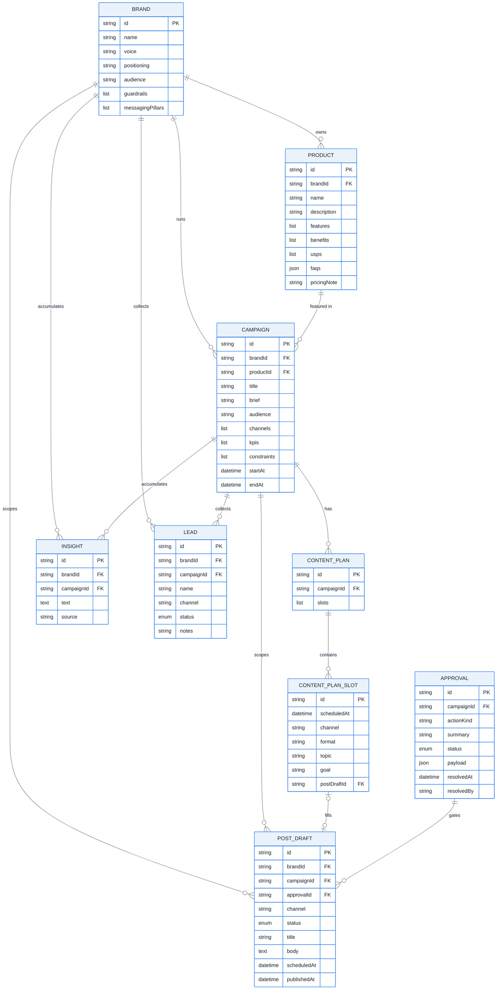
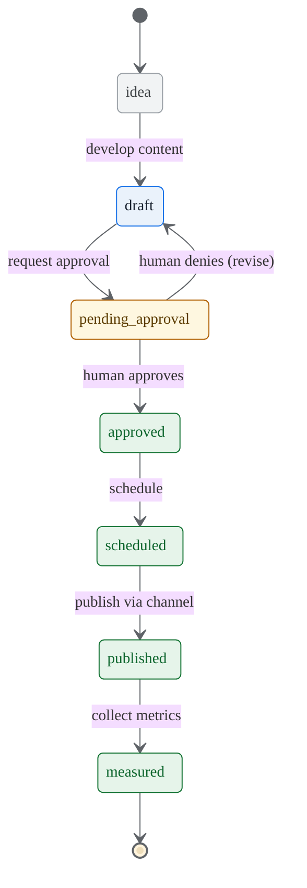
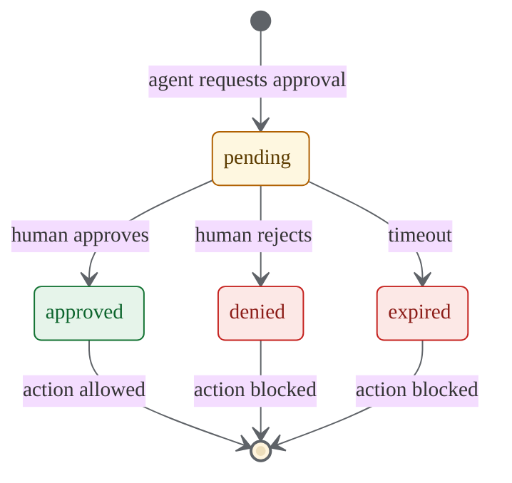

# FoxFang Marketing Store — Data Model (ERD)

> Verified against source: `src/marketing/types.ts`, `src/marketing/store.ts`,
> `src/marketing/post-draft-ops.ts`. Field names and relationships match the
> implemented `MarketingStore` (JSON store, version 1).
>
> Render check: paste any block into <https://mermaid.live> or open this file in a
> Mermaid-aware viewer (VS Code "Markdown Preview Mermaid Support", GitHub, Obsidian).
> Rendered PNGs live in `media/` (see file names under each diagram).
> All labels are in English so the diagrams can be dropped straight into Chapter 3.

> **Shared base fields.** Every record extends `MarketingRecordBase`:
> `id`, `createdAt`, `updatedAt`, optional `agentId`, optional `campaignId`.
> To keep the diagram readable, only `id` and the distinctive fields are shown per entity.

---

## 1. Entity Relationship Diagram (core marketing store)

> Rendered: `media/figure_3_4_marketing_store_erd.png`

### Relationship summary

| Relationship                       | Type   | Source field                  | Meaning                                                        |
| ---------------------------------- | ------ | ----------------------------- | -------------------------------------------------------------- |
| Brand → Product                    | 1–n    | `Product.brandId`             | A brand owns many products.                                    |
| Brand → Campaign                   | 1–n    | `Campaign.brandId`            | A brand runs many campaigns.                                   |
| Product → Campaign                 | 1–n    | `Campaign.productId`          | A product is featured in many campaigns.                       |
| Brand → PostDraft                  | 1–n    | `PostDraft.brandId`           | Each draft is scoped to a brand.                               |
| Campaign → PostDraft               | 1–n    | `PostDraft.campaignId`        | Each draft is scoped to a campaign.                            |
| Campaign → ContentPlan             | 1–n    | `ContentPlan.campaignId`      | A campaign has one or more content plans.                      |
| ContentPlan → ContentPlanSlot      | 1–n    | `ContentPlan.slots[]`         | A plan contains many calendar slots (embedded).               |
| ContentPlanSlot → PostDraft        | 0..1   | `ContentPlanSlot.postDraftId` | A slot may be filled by one draft.                            |
| Approval → PostDraft               | 1–n    | `PostDraft.approvalId`        | One approval can gate one or several cross-channel drafts.    |
| Brand / Campaign → Insight         | 1–n    | `Insight.brandId/campaignId`  | Insights accumulate under a brand and a campaign.             |
| Brand / Campaign → Lead            | 1–n    | `Lead.brandId/campaignId`     | Leads are collected under a brand and a campaign.            |

> `ContentPlanSlot` is an embedded (weak) entity stored inside `ContentPlan.slots`,
> not a separate top-level collection. `channel` is a string identifier on
> `Campaign`, `PostDraft`, `ContentPlanSlot`, and `Lead` (e.g. `facebook`,
> `telegram`); there is no separate `Channel` table. `audience` is likewise a free
> text field on `Brand` and `Campaign`.

---

## 2. PostDraft lifecycle (approval-before-write gate)

> Rendered: `media/figure_3_5_postdraft_lifecycle.png`

The `PostDraft.status` enum encodes the **read-first, draft-first,
approval-before-write** principle. A draft cannot reach `published` without first
passing through human approval.

---

## 3. Approval lifecycle (sensitive outbound actions)

> Rendered: `media/figure_3_6_approval_lifecycle.png`

Every sensitive outbound action (`actionKind`: `publish_post`, `bulk_message`,
`ads_write`, `integration_write`) is represented by an `Approval` record. The agent
may only proceed once a human resolves it.

